Trying to experiment and dig into Python's synchronous/asynchronous I/O.
The goal is to compare which one is faster in handling bulk task concurrently or not.
However, it turns out to be more complex/tricky than I thought...
because there are quite a few modules that can do that, like multiprocessing, threading, queue, and etc.

and, instead of wasting too much time to meet my needs,
i came to the simple conclusion below that can be easily understood.

- **sync (I/O block)** -> _threadpool_ -> parallelism == concurrent -> not shared event loop -> different thread == independently.
- actually using `threading` are more best for CPU bound with synchronization and coordination between tasks. 
- _concurrent programs can be parallel, but not all concurrent programs are parallel._
- _parallel programs can be concurrent, but not all parallel programs are concurrent._
  from: https://www.linkedin.com/advice/0/whats-difference-between-concurrent-parallel-programming
- **async (I/O non block)** -> _asyncio gather_ -> concurrency -> run in single thread and in same event loop.
- **async** best for I/O? because there's no need waiting http request till complete and all tasks run overlapping in the same event loop.
- there's nothing any significant advantage if calling an asynchronous function for once, it's only best for multiple tasks.

for that, i was really curious, so i tested it by calling sync and async functions inside a for loop
10 times, and honestly, there was nothing difference.
it just made me waste a lot of time writing more complex code.

In I/O testing, there are a lot of dependencies that make the results vary,
like the Python version (there are many performance testing articles on Python, for example,
Python 3.12, which they say is faster than the previous versions, and so on),
the speed of the HDD/SSD in reading files (especially if the file is over 1GB),
and the internet speed or server speed.

Here, I don't really care about the [GIL](https://en.wikipedia.org/wiki/Global_interpreter_lock) issue in Python because,
this is just I/O testing, and the [Python GIL](https://wiki.python.org/moin/GlobalInterpreterLock) only applies to CPU testing.
But I also found something interesting, because in Python 3.13 and above, there's no GIL anymore.

asyncio py3.10: https://docs.python.org/3.10/library/asyncio-task.html

threadpool py3.10: https://docs.python.org/3.10/library/asyncio-task.html

many help: https://stackoverflow.com/a/70459437/

speedtest files: https://downloadtestfile.com/

python nogil:

- https://stackoverflow.com/a/77519536/
- https://peps.python.org/pep-0703/
- https://developer.vonage.com/en/blog/removing-pythons-gil-its-happening

I'm trying to take the average results after repeating it several times.

### demo

 

 

   Python 3.10.12 
 

 

 

 

   Python 3.11.7
 

 

 

 

 Python 3.12.1 
 

 

 

 

   Python 3.13.0a2
 

 

> [!NOTE]
> Perhaps there's some explanation lacking or even incorrect. i've jusst learned through what i have used in each of my projects out of curiosity about how they all work as well. i hope if someone who knowledgeable about concurrent/parallelism sees this, they'll join in to correct it. 

## License

This project is licensed under the [MIT License](LICENSE).
